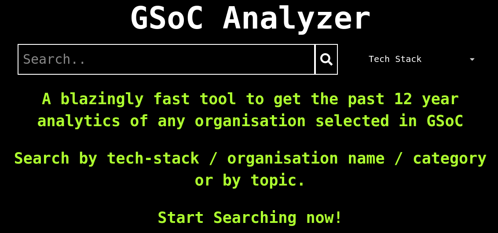
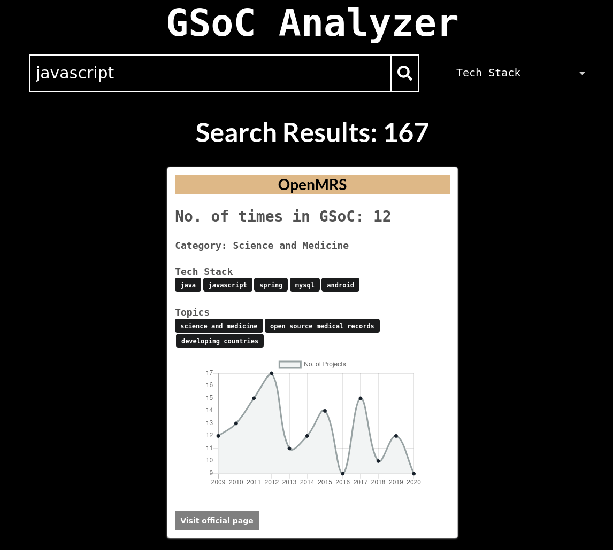
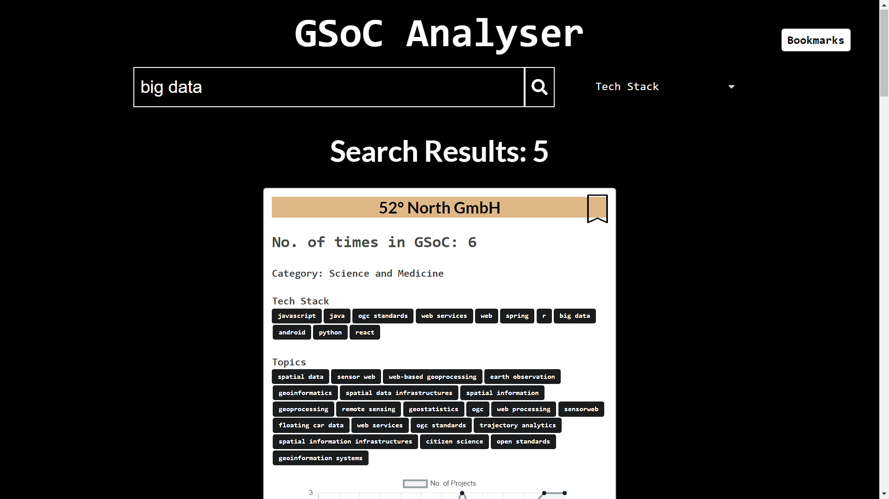
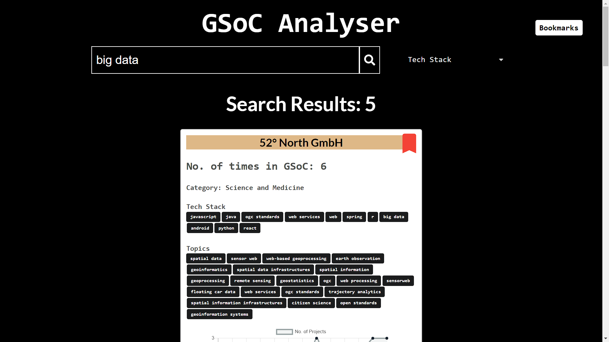
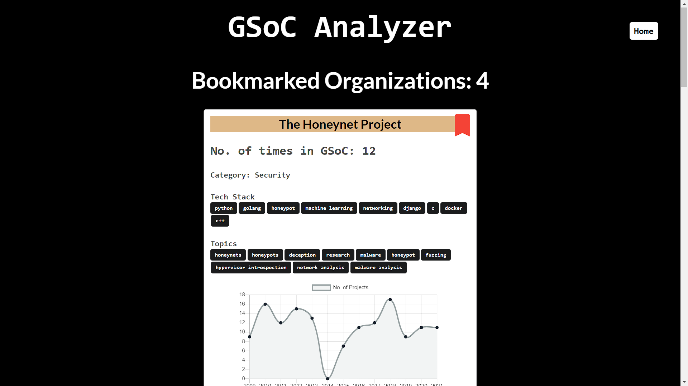
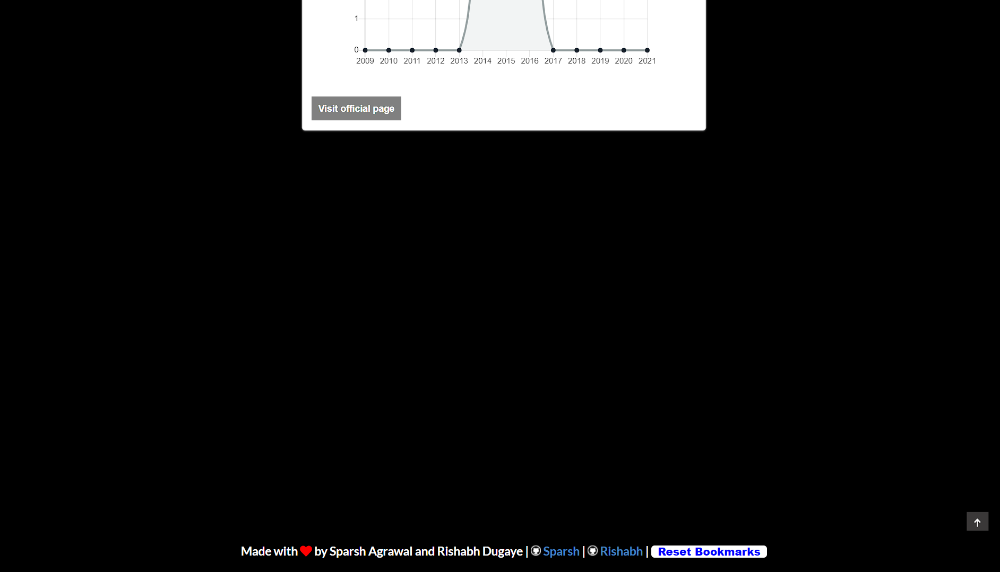
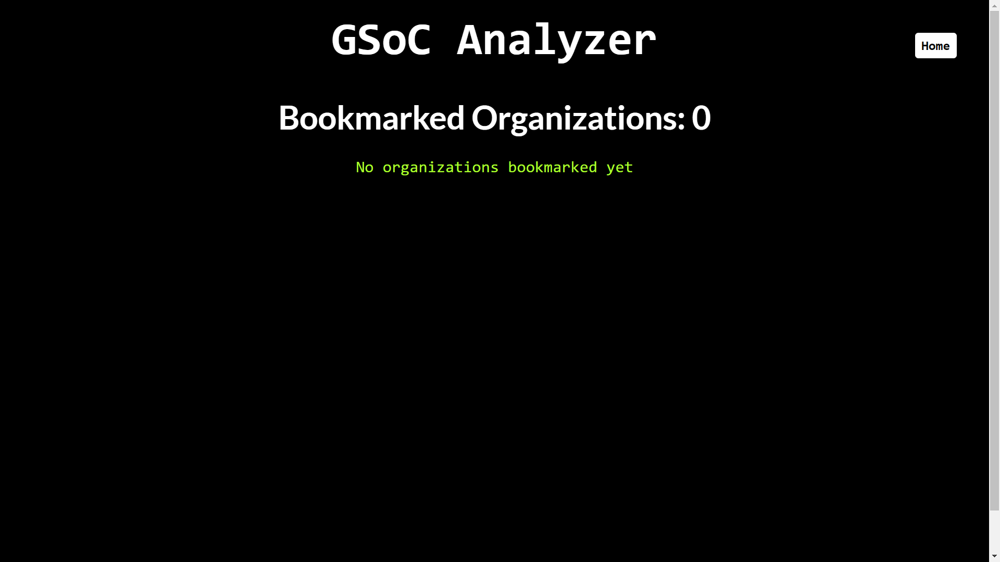

# GSoC Analyser

GSoC: Google Summer of Code; 'Oscar of the Coding World', as they popularly call it; has immense mystique surrounding it.Nurturing this dream, as many aspirants step in here, analyzing the right organizations to contribute becomes the most crucial step!

‘GSoC Analyser’, has everything an applicant would need. Not only does it enable the search by tech-stack/organization/category/topics, but displays the number of times of its applications in GSoC to graphical analytics of its projects each year, & everything else under the sun, based on last 12-year analytics.

## Link to website: https://sparsh1212.github.io/gsocanalyzer/

### Home Page

### Search by organisation name

### Search by tech-stack

## Bookmark 
### Bookmarking feature allows you to save your favorite organisation and then quickly access them in the browser.

Here is a short intro which will help you get started with bookmarking in GSoC Analyser.

To add Bookmark search your favorite organization and click on the ribbon icon next to it.

After adding your organization the ribbon will turn red, congrats you've successfully added a bookmark.

You can check for your Bookmarks by going to bookmark.

You can also clear Bookmark by clicking clear bookmark in footer.

After clearing Bookmark Bookmark bar will become like this. 

# Setup:
- Clone the repo
- cd into the repo directory
- Run: `npm install`
- Run: `npm start`

# Contributing :

- Fork the repo.
- Create a new branch named <your_feature>
- Commit changes and make a PR.
- PRs are welcome.
