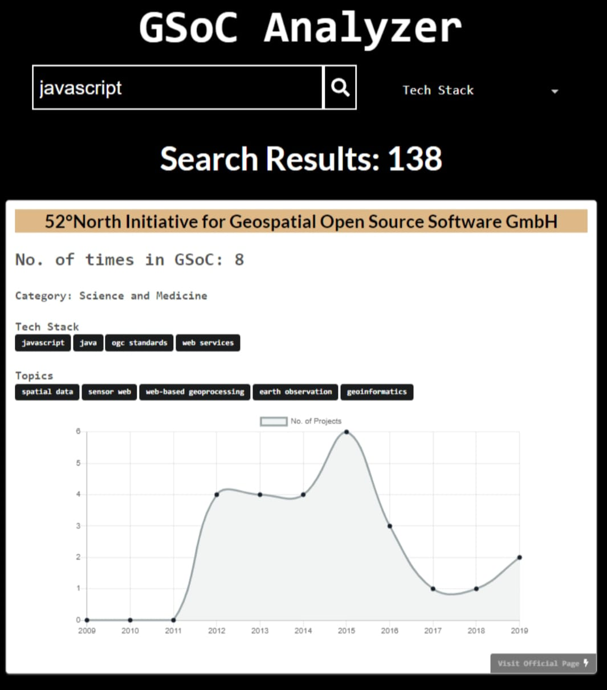

# GSoC Analyser

GSoC: Google Summer of Code; 'Oscar of the Coding World', as they popularly call it; has immense mystique surrounding it.Nurturing this dream, as many aspirants step in here, analyzing the right organizations to contribute becomes the most crucial step!

Having stated that, we bring to you our mini-project: ‘GSoC Analyser’, that has everything an applicant would need. Not only does it enable the search by tech-stack/organization/category/topics, but displays the number of times of its applications in GSoC to graphical analytics of its projects each year, & everything else under the sun, based on last 11-year analytics. 

Our sole motivation to move ahead with this idea has been the tremendous stress & dilemma young developers face in selecting the right organization to contribute.

